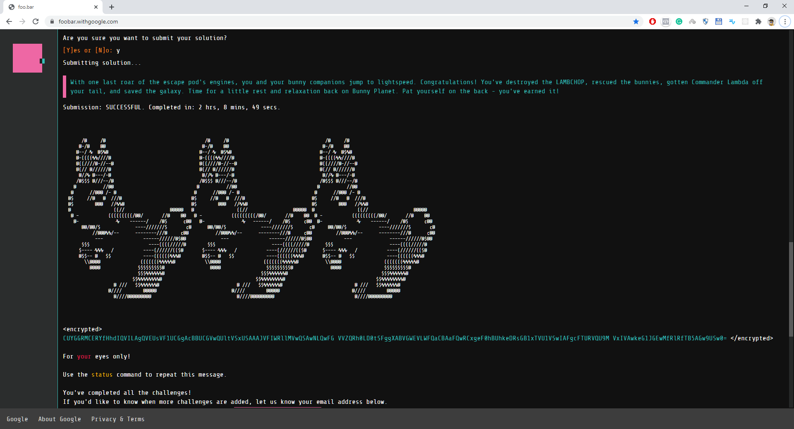

# Google Foobar 2020

The following repository contains all my solutions to the Google Foobar Challenge 2020.
I have added a README file and my solution to each challenge under their respective directories.

## Challenges

[Journal](Journal/README.md)

### Level 1

- [Solar Doomsday](Level-1/solar_doomsday/README.md)

### Level 2

- [Ion Flux Relabeling](Level-2/ion_flux_relabeling/README.md)
- [Power Hungry](Level-2/power_hungry/README.md)

### Level 3

- [Bomb Baby](Level-3/bomb_baby/README.md)
- [Doomsday Fuel](Level-3/doomsday_fuel/README.md)
- [The Grandest Staircase Of Them All](Level-3/the_grandest_staircase_of_them_all/README.md)

### Level 4

- [Free The Bunny Prisoners](Level-4/free_the_bunny_prisoners/README.md)
- [Running With Bunnies](Level-4/running_with_bunnies/README.md)

### Level 5

- [Dodge The Lasers](Level-5/dodge_the_lasers/README.md)

